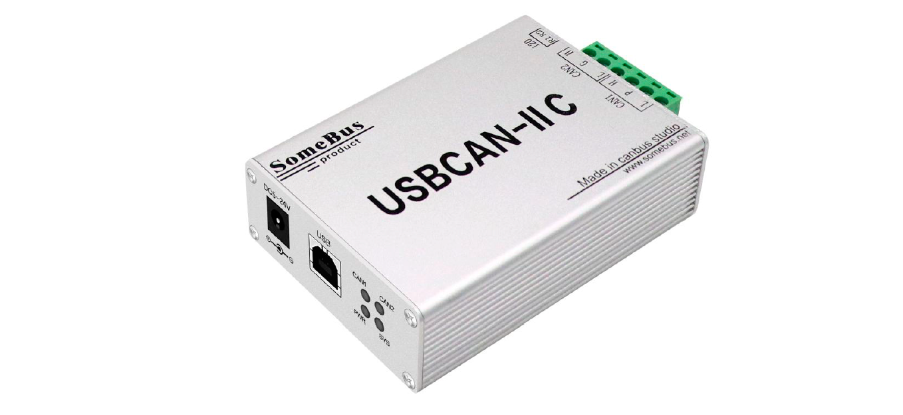

## OVERVIEW

The **USBCAN Software Development Kit** is developed based on Ecan (ECanVci.dll) Interface Function Library (User Manual V5.1). 
Using this SDK, users can send/receive data to/from connected devices.

